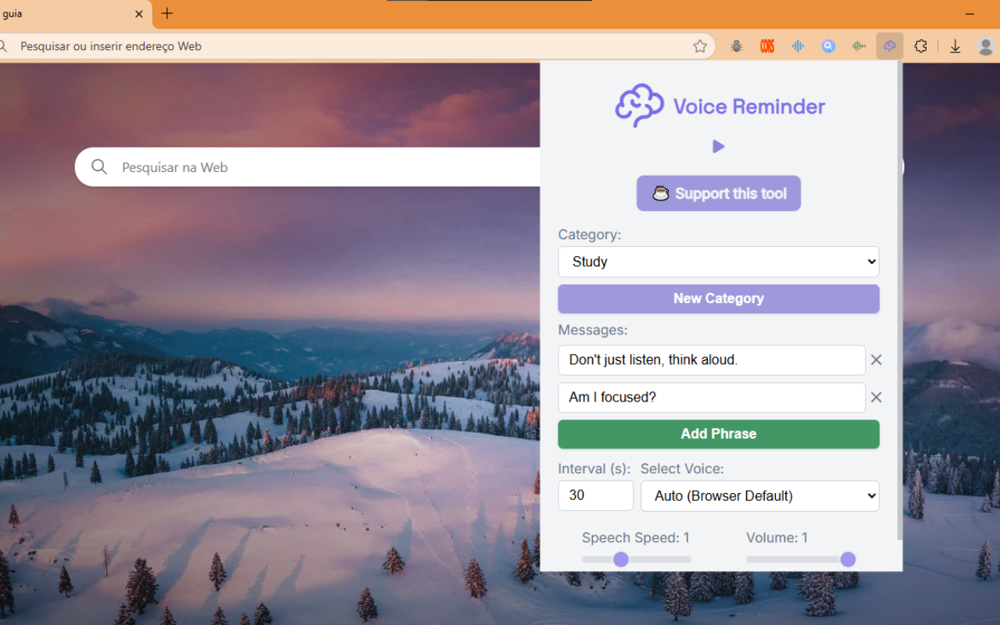

<div align="center">
   <h1>Voice Reminder — Keep Focus</h1>
   <h3>The periodic voice nudge you need to keep focused</h3>
   
   <p>Voice Reminder Chrome Extension<p>
</div>

## Features ✨

- **Custom Messages** 📝: Add multiple reminder phrases to cycle through.
- **Adjustable Intervals** ⏱️: Set how often reminders are spoken (in seconds).
- **Voice Selection** 🗣️: Choose from available browser voices or use the default.
- **Speech Customization** 🎚️: Adjust speech speed and volume.
- **Start/Stop Control** ▶️⏹️: Easily toggle reminders on or off.

## Installation 🛠️

### Option 1: Chrome Web Store
- Install directly from the [Chrome Web Store](https://chrome.google.com/webstore/detail/placeholder).

### Option 2: Manual Installation
1. **Clone the Repository** 🖥️
   ```bash
   git clone https://github.com/pablo-s-dev/voice-reminder
   ```
2. **Open Chrome Extensions** 🧩
   - Go to `chrome://extensions/` in Chrome.
   - Enable **Developer mode** (top-right toggle).
3. **Load the Extension** 📂
   - Click **Load unpacked** and select the cloned repository folder.
4. **Use the Extension** 🎉
   - Click the extension icon in Chrome to open the popup.


## Usage 📚

1. **Open the Popup** 🖱️
   - Click the extension icon in Chrome.
2. **Add Phrases** ➕
   - Enter reminder phrases and click **Add Phrase** to include more.
3. **Set Interval** ⏰
   - Input the interval (in seconds, minimum 5) for reminders.
4. **Customize Voice** 🎙️
   - Select a voice from the dropdown and adjust speed/volume sliders.
5. **Categories** 🏷
   - Save configs in separate categories for reusability.

## Contributing 🤝

Contributions are welcome! Please:
- Fork the repository.
- Create a feature branch (`git checkout -b feature/awesome-feature`).
- Commit changes (`git commit -m 'Add awesome feature'`).
- Push to the branch (`git push origin feature/awesome-feature`).
- Open a pull request.

## Planned Features 🌟
- An option to randomize the phrases order.

## Changelog 📜

### [1.0.0] - 2025-06-17
- Initial release with custom messages, interval settings, voice selection, and speech speed/volume controls.
### [1.1.0] - 2025-08-16
- Categories
### [1.1.1] - 2025-08-17
- Categories Fix
### [1.1.5] - 2025-08-24
- Lots of fixes (saving categories, min interval)
- Style changes